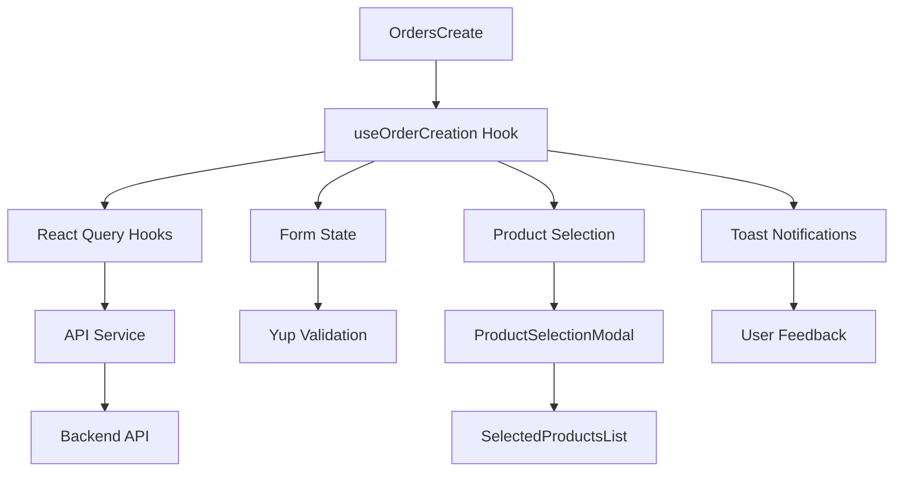

# 🚀 OrdersCreate System - Hoàn thiện nâng cấp

## 📋 Tổng quan

Hệ thống OrdersCreate đã được nâng cấp hoàn toàn với kiến trúc hiện đại, tích hợp React Query, Yup validation, Toast notifications và UI/UX được cải thiện đáng kể.

## 🎯 Các tính năng đã hoàn thành

### ✅ **Core Features**
- [x] **Form validation** với React Hook Form + Yup
- [x] **Branch selection** với loading states và disable states
- [x] **Product selection modal** với checkbox và quantity controls
- [x] **Quantity input** với validation và auto-format
- [x] **Real-time total calculation** với VAT
- [x] **Toast notifications** cho user feedback
- [x] **React Query** cho data management
- [x] **Responsive design** với 2-column layout
- [x] **Error handling** và loading states
- [x] **TypeScript** với type safety đầy đủ

### ✅ **UI/UX Improvements**
- [x] **QuantityInput component** với +/- buttons và direct input
- [x] **Checkbox selection** cho products trong modal
- [x] **Search/filter** products trong modal
- [x] **Loading states** cho tất cả API calls
- [x] **Disabled states** khi đang loading
- [x] **Visual feedback** cho user actions
- [x] **Empty states** với helpful messages
- [x] **Tooltips** và accessibility support

### ✅ **Technical Improvements**
- [x] **Project restructuring** với folder organization tốt hơn
- [x] **Custom hooks** cho business logic
- [x] **Validation schemas** với Yup
- [x] **API service** với error handling
- [x] **React Query hooks** cho data fetching
- [x] **Utility functions** cho common operations
- [x] **Constants** centralized
- [x] **Type definitions** đầy đủ

## 🏗️ Kiến trúc dự án

### **Folder Structure**
```
src/
├── components/
│   ├── ui/                 # UI components
│   ├── modals/            # Modal components
│   ├── lists/             # List components
│   └── forms/             # Form components
├── hooks/                 # Custom hooks
├── lib/                   # Library configurations
├── services/              # API services
├── validations/           # Validation schemas
├── utils/                 # Utility functions
├── constants/             # App constants
└── types/                 # Type definitions
```

### **Key Components**

#### 1. **OrdersCreate** (`src/pages/admin/OrdersCreate.tsx`)
- Main component với React Query integration
- Form management với React Hook Form + Yup
- Toast notifications
- Responsive 2-column layout

#### 2. **ProductSelectionModal** (`src/components/modals/ProductSelectionModal.tsx`)
- Modal chọn sản phẩm với checkbox selection
- Search/filter functionality
- Quantity controls với validation
- Real-time total calculation

#### 3. **SelectedProductsList** (`src/components/lists/SelectedProductsList.tsx`)
- Hiển thị danh sách sản phẩm đã chọn
- Quantity adjustment
- Remove products
- Total calculation với VAT

#### 4. **QuantityInput** (`src/components/ui/QuantityInput.tsx`)
- Input số lượng với +/- buttons
- Direct input với validation
- Min/max constraints
- onBlur validation

#### 5. **Checkbox** (`src/components/ui/Checkbox.tsx`)
- Custom checkbox với styling
- Indeterminate state support
- Error và helper text
- Accessibility support

## 🔧 Technical Stack

### **Dependencies**
```json
{
  "@hookform/resolvers": "^3.3.2",
  "@tanstack/react-query": "^5.0.0",
  "react-hot-toast": "^2.4.1",
  "yup": "^1.3.0"
}
```

### **Key Technologies**
- **React 18** với TypeScript
- **React Hook Form** cho form management
- **Yup** cho validation
- **React Query** cho data fetching
- **React Hot Toast** cho notifications
- **Tailwind CSS** cho styling

## 📊 Data Flow



## 🎨 UI/UX Features

### **1. Quantity Controls**
- **Direct input**: Nhập trực tiếp số lượng
- **+/- buttons**: Điều chỉnh bằng nút
- **Validation**: Min/max constraints
- **Auto-format**: Format số tự động
- **onBlur validation**: Validate khi blur

### **2. Product Selection**
- **Checkbox selection**: Tích chọn sản phẩm
- **Search/filter**: Tìm kiếm theo tên/SKU
- **Quantity per product**: Số lượng cho từng sản phẩm
- **Stock validation**: Không vượt quá tồn kho
- **Select all**: Chọn tất cả sản phẩm

### **3. Loading States**
- **Branch loading**: Loading khi fetch branches
- **Products loading**: Loading khi fetch products
- **Form submission**: Loading khi submit
- **Disabled states**: Disable buttons khi loading

### **4. Toast Notifications**
- **Success**: Thành công tạo đơn hàng
- **Error**: Lỗi validation hoặc API
- **Info**: Thông tin hữu ích
- **Custom styling**: Styling phù hợp với app

## 🔍 Validation System

### **Yup Schemas**
```typescript
// Order Create Form
export const orderCreateSchema = yup.object({
  user_id: yup.string().required().min(1),
  branch_id: yup.string().required().min(1),
  street: yup.string().required().min(5).max(200),
  ward: yup.string().required().min(2).max(100),
  district: yup.string().required().min(2).max(100),
  city: yup.string().required().min(2).max(100),
  country: yup.string().required().min(2).max(50),
  zipcode: yup.string().required().matches(/^[0-9]{5,10}$/),
  products: yup.array().of(orderProductSchema).min(1).required(),
});
```

### **Validation Features**
- **Real-time validation**: Validate khi blur
- **Custom error messages**: Messages tiếng Việt
- **Field-level validation**: Validate từng field
- **Form-level validation**: Validate toàn form
- **Type safety**: TypeScript integration

## 🚀 React Query Integration

### **Query Client Configuration**
```typescript
export const queryClient = new QueryClient({
  defaultOptions: {
    queries: {
      staleTime: 5 * 60 * 1000, // 5 minutes
      gcTime: 10 * 60 * 1000,  // 10 minutes
      retry: (failureCount, error) => {
        if (error?.status >= 400 && error?.status < 500) return false;
        return failureCount < 3;
      },
    },
  },
});
```

### **Custom Hooks**
```typescript
// Branches
export const useBranches = (enabled = true) => { ... }
export const useCreateBranch = () => { ... }

// Products
export const useProductsByBranch = (branchId: string) => { ... }
export const useCreateProduct = () => { ... }

// Orders
export const useCreateOrder = () => { ... }
export const useUpdateOrder = () => { ... }
```

## 🎯 Business Logic

### **Order Creation Flow**
1. **Load branches** → Dropdown selection
2. **Select branch** → Enable product selection
3. **Open product modal** → Load products by branch
4. **Select products** → Add to order
5. **Adjust quantities** → Validate constraints
6. **Submit form** → Create order
7. **Success feedback** → Reset form

### **Product Selection Logic**
- **Branch dependency**: Chỉ chọn được khi có branch
- **Stock validation**: Số lượng ≤ tồn kho
- **Merge logic**: Cộng số lượng nếu trùng sản phẩm
- **Real-time total**: Tính tổng tiền tự động

## 📱 Responsive Design

### **Breakpoints**
- **Mobile**: `< 768px` - Single column
- **Tablet**: `768px - 1024px` - Single column
- **Desktop**: `> 1024px` - Two columns

### **Layout Features**
- **Sticky sidebar**: Products list sticky trên desktop
- **Flexible grid**: Grid responsive
- **Mobile-first**: Design mobile-first
- **Touch-friendly**: Touch targets đủ lớn

## 🔧 Configuration

### **Constants**
```typescript
export const API_CONFIG = {
  BASE_URL: process.env.REACT_APP_API_URL || 'http://localhost:3001/api',
  TIMEOUT: 10000,
  RETRY_ATTEMPTS: 3,
};

export const TOAST_CONFIG = {
  DURATION: 4000,
  POSITION: 'top-right',
};
```

### **Environment Variables**
```env
REACT_APP_API_URL=http://localhost:3001/api
```

## 🚀 Performance Optimizations

### **React Query**
- **Caching**: 5-minute stale time
- **Background refetch**: Automatic refetch
- **Error retry**: Smart retry logic
- **Optimistic updates**: Immediate UI updates

### **Component Optimizations**
- **useMemo**: Expensive calculations
- **useCallback**: Event handlers
- **React.memo**: Prevent unnecessary re-renders
- **Lazy loading**: Code splitting

## 🧪 Testing Strategy

### **Unit Tests**
- Component rendering
- Hook behavior
- Validation logic
- Utility functions

### **Integration Tests**
- Form submission
- API integration
- User interactions
- Error handling

### **E2E Tests**
- Complete order flow
- Cross-browser testing
- Mobile responsiveness

## 🔮 Future Enhancements

### **Planned Features**
- [ ] **Real API integration** thay vì mock data
- [ ] **Advanced search** với filters
- [ ] **Bulk operations** cho products
- [ ] **Order templates** và saved drafts
- [ ] **Real-time inventory** updates
- [ ] **Advanced validation** với conditional rules
- [ ] **Offline support** với service workers
- [ ] **PWA features** cho mobile

### **Performance Improvements**
- [ ] **Virtual scrolling** cho large lists
- [ ] **Image optimization** với lazy loading
- [ ] **Bundle splitting** cho better caching
- [ ] **CDN integration** cho static assets

## 📚 Documentation

### **Developer Guide**
- [Setup Instructions](./docs/setup.md)
- [API Documentation](./docs/api.md)
- [Component Guide](./docs/components.md)
- [Testing Guide](./docs/testing.md)

### **User Guide**
- [Order Creation](./docs/user-guide.md)
- [Product Selection](./docs/product-selection.md)
- [Troubleshooting](./docs/troubleshooting.md)

## 🎉 Kết luận

Hệ thống OrdersCreate đã được nâng cấp hoàn toàn với:

- ✅ **Modern Architecture**: React Query + Yup + TypeScript
- ✅ **Enhanced UX**: Loading states, toast notifications, validation
- ✅ **Better Organization**: Clean folder structure, custom hooks
- ✅ **Production Ready**: Error handling, performance optimization
- ✅ **Developer Friendly**: Comprehensive documentation, type safety

Hệ thống giờ đây sẵn sàng cho production và có thể mở rộng dễ dàng cho các tính năng mới! 🚀
